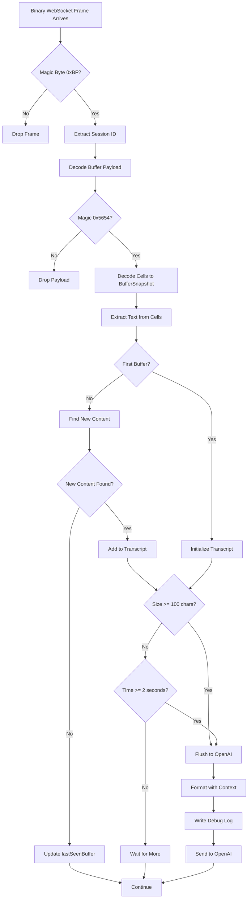

# Buffer Update Flow: VibeTunnel → WebSocket → VibeTunnelTalk → OpenAI

This document provides **extreme detail** on how terminal buffer data flows from VibeTunnel through our WebSocket connection, into VibeTunnelTalk's processing pipeline, and ultimately to OpenAI's Realtime API.

## Table of Contents
1. [Overview](#overview)
2. [Stage 1: WebSocket Data Reception](#stage-1-websocket-data-reception)
3. [Stage 2: Binary Protocol Decoding](#stage-2-binary-protocol-decoding)
4. [Stage 3: Buffer Accumulation Logic](#stage-3-buffer-accumulation-logic)
5. [Stage 4: Smart Terminal Processing](#stage-4-smart-terminal-processing)
6. [Stage 5: OpenAI Communication](#stage-5-openai-communication)
7. [Debug Logging Flow](#debug-logging-flow)
8. [Decision Tree Summary](#decision-tree-summary)

## Overview

The complete data flow path:
```
VibeTunnel Server → WebSocket Binary Stream → BufferWebSocketClient → SmartTerminalProcessor
→ BufferAccumulator → OpenAI Realtime API
```

Key components:
- **BufferWebSocketClient**: Receives binary WebSocket frames from VibeTunnel
- **SmartTerminalProcessor**: Orchestrates processing and manages accumulation
- **BufferAccumulator**: Intelligent batching with size/time thresholds
- **OpenAIRealtimeManager**: Sends accumulated content to OpenAI

## Stage 1: WebSocket Data Reception

### Connection Establishment
```swift
// BufferWebSocketClient.swift:68-129
```

1. **URL Formation**: `ws://localhost:4020/buffers`
2. **Authentication**: JWT token added BOTH as:
   - Query parameter: `?token={jwt}`
   - Authorization header: `Bearer {jwt}`
3. **Subscription**: After connection, sends JSON message:
   ```json
   {
     "type": "subscribe",
     "sessionId": "session-uuid"
   }
   ```

### Message Reception
When VibeTunnel sends data, it arrives in `handleMessage()`:
- **Binary messages**: Terminal buffer updates (most common)
- **Text messages**: JSON control messages (ping, errors, etc.)

## Stage 2: Binary Protocol Decoding

### Binary Frame Structure
```
BufferWebSocketClient.swift:176-229 - handleBinaryMessage()
```

Each binary message from VibeTunnel has this structure:

```
[1 byte]   Magic byte (0xBF)
[4 bytes]  Session ID length (little-endian uint32)
[N bytes]  Session ID (UTF-8 string)
[M bytes]  Buffer payload
```

### Buffer Payload Structure
```
BufferWebSocketClient.swift:245-430 - decodeBinaryBuffer()
```

The buffer payload itself has:

```
Header (32 bytes):
[2 bytes]  Magic bytes "VT" (0x5654 little-endian)
[1 byte]   Version (0x01)
[1 byte]   Flags (bit 0 = bell)
[4 bytes]  Cols (little-endian uint32)
[4 bytes]  Rows (little-endian uint32)
[4 bytes]  ViewportY (little-endian int32)
[4 bytes]  CursorX (little-endian int32)
[4 bytes]  CursorY (little-endian int32)
[4 bytes]  Reserved

Cells data (variable):
Row markers:
- 0xFE [1 byte count]: Empty rows (repeated count times)
- 0xFD [2 bytes cell_count]: Row with content

Cell encoding:
[1 byte]   Type byte (flags for extended, unicode, colors, etc.)
[variable] Character data (ASCII byte or Unicode with length prefix)
[optional] Extended data (attributes, foreground color, background color)
```

### Decoded Output: BufferSnapshot
After decoding, we get a `BufferSnapshot` object:
```swift
struct BufferSnapshot {
    let cols: Int        // Terminal width in columns
    let rows: Int        // Terminal height in rows
    let viewportY: Int   // Scroll position
    let cursorX: Int     // Cursor column position
    let cursorY: Int     // Cursor row position
    let cells: [[BufferCell]]  // 2D array of cells
}

struct BufferCell {
    let char: String     // The character (can be Unicode, emoji, etc.)
    let width: Int       // Display width (1 for normal, 2 for wide/CJK)
    let fg: Int?        // Foreground color (palette index or RGB)
    let bg: Int?        // Background color
    let attributes: Int? // Bold, italic, underline, etc.
}
```

## Stage 3: Buffer Accumulation Logic

### Initial Processing
```
SmartTerminalProcessor.swift:98-119 - processWebSocketSnapshot()
```

When a `BufferSnapshot` arrives:
1. **Text Extraction**: Convert 2D cell array to plain text
2. **Change Detection**: Compare with `lastSentContent`
3. **Accumulator Handoff**: Pass to `BufferAccumulator`

### BufferAccumulator Decision Logic
```
BufferAccumulator.swift:36-79 - accumulate()
```

The accumulator maintains three critical pieces of state:

```swift
private var sessionTranscript = ""   // Complete history of everything seen
private var lastSentIndex = 0        // Position in transcript we've sent up to
private var lastSeenBuffer = ""      // The last buffer content we saw
```

#### First Buffer Special Case
```swift
// Lines 42-52
if lastSeenBuffer.isEmpty {
    sessionTranscript = extractedContent + "\n"
    pendingContentSize = extractedContent.count
    firstAccumulationTime = Date()
    lastSeenBuffer = extractedContent
    checkThresholds()
}
```

#### Subsequent Buffers
```swift
// Lines 54-78
// 1. Find new content by comparing buffers
let newContent = findNewContent(from: lastSeenBuffer, to: extractedContent)

// 2. Add to transcript if new
if !newContent.isEmpty {
    sessionTranscript += newContent
    pendingContentSize = sessionTranscript.count - lastSentIndex
    if firstAccumulationTime == nil {
        firstAccumulationTime = Date()
    }
}

// 3. Update last seen
lastSeenBuffer = extractedContent

// 4. Check if we should flush
checkThresholds()
```

### New Content Detection Algorithm
```
BufferAccumulator.swift:82-111 - findNewContent()
```

The algorithm for detecting new content:

1. **Line-by-Line Comparison**:
   ```swift
   let oldLines = Set(oldBuffer.components(separatedBy: .newlines))
   let newLines = newBuffer.components(separatedBy: .newlines)

   for line in newLines {
       if !oldLines.contains(line) {
           // This line is new
           newContent.append(line)
       }
   }
   ```

2. **Similarity Check** (for major changes):
   ```swift
   let similarity = calculateSimilarity(oldBuffer, newBuffer)
   if similarity < 0.3 {
       // Buffers are very different (< 30% similar)
       // Capture entire current buffer as "[Buffer Update]"
       return "[Buffer Update]\n" + newBuffer + "\n"
   }
   ```

### Threshold Decision Logic
```
BufferAccumulator.swift:126-155 - checkThresholds()
```

Two thresholds trigger flushing:

```swift
// Size threshold (default: 100 characters)
if unsentSize >= sizeThreshold {
    flush()  // Send immediately
}

// Time threshold (default: 2.0 seconds)
if elapsed >= timeThreshold {
    flush()  // Send after timeout
}
```

### Flush Operation
```
BufferAccumulator.swift:175-199 - flush()
```

When flushing:
1. Extract unsent portion: `sessionTranscript[lastSentIndex...]`
2. Call callback with unsent content
3. Update `lastSentIndex = sessionTranscript.count`
4. Reset timers and pending state

## Stage 4: Smart Terminal Processing

### Accumulator Callback
```
SmartTerminalProcessor.swift:57-68
```

When BufferAccumulator decides to flush, it calls:
```swift
{ [weak self] content, changeCount in
    self?.lastSentContent = content
    self?.sendUpdateToOpenAI(content, changeCount: changeCount)
}
```

### Text Extraction from BufferSnapshot
```
SmartTerminalProcessor.swift:143-162 - extractTextFromBuffer()
```

Converting cells to text:
```swift
for row in snapshot.cells {
    var line = ""
    for cell in row {
        line += cell.displayChar  // Use space if char is empty
    }
    lines.append(line.trimmingCharacters(in: " "))
}
// Remove trailing empty lines
while lines.last?.isEmpty == true {
    lines.removeLast()
}
return lines.joined(separator: "\n")
```

### Change Counting Algorithm
```
SmartTerminalProcessor.swift:184-202 - countChanges()
```

Measures the size of changes between two strings:
```swift
// Find common prefix
let commonPrefixLength = zip(old, new).prefix(while: { $0 == $1 }).count

// Find common suffix (after prefix)
let commonSuffixLength = zip(oldSuffix.reversed(), newSuffix.reversed())
    .prefix(while: { $0 == $1 }).count

// Changed region is what's between prefix and suffix
let oldChangedLength = old.count - commonPrefixLength - commonSuffixLength
let newChangedLength = new.count - commonPrefixLength - commonSuffixLength

return max(oldChangedLength, newChangedLength)
```

## Stage 5: OpenAI Communication

### Content Formatting
```
SmartTerminalProcessor.swift:246-252 - formatForOpenAI()
```

Content is wrapped with context:
```swift
return """
    [Terminal Output Update]
    \(content)
    """
```

### Sending to OpenAI
```
SmartTerminalProcessor.swift:207-243 - sendUpdateToOpenAI()
```

Process:
1. Format content with context marker
2. Write to debug log file
3. Call `openAIManager.sendTerminalContext(formattedContent)`
4. Update statistics (data reduction ratio, total updates sent)

## Debug Logging Flow

### Log File Creation
```
SmartTerminalProcessor+DebugLogging.swift:7-48 - createDebugFile()
```

Location: `~/Library/Logs/VibeTunnelTalk/openai_updates_{timestamp}.txt`

### Log Entry Format
```
SmartTerminalProcessor+DebugLogging.swift:50-83 - writeToDebugFile()
```

Each update logged with:
```
[HH:mm:ss.SSS] - Update #{number}
----------------------------------------
Snapshots processed: {total_snapshots}
Data reduction: {percentage}%
Characters sent: {char_count}
Buffer stats: rows={r}, cols={c}, non_empty_cells={n}
----------------------------------------
CONTENT SENT TO OPENAI:
{actual_content}
========================================
```

### What Triggers Logging

**LOGGED**:
- Every content sent to OpenAI (in `sendUpdateToOpenAI()`)
- Session start header
- Buffer processing statistics

**NOT LOGGED**:
- Individual buffer snapshots (too frequent)
- Content that doesn't meet thresholds
- Intermediate processing states

## Decision Tree Summary



## Key Insights

### Accumulation Strategy
- **Session Transcript**: Maintains complete history, only sends unsent portions
- **Line-Based Deduplication**: Prevents sending duplicate lines
- **Similarity Threshold**: Captures major buffer changes (< 30% similarity)

### Thresholds
- **Size**: 100 characters of unsent content triggers immediate send
- **Time**: 2 seconds of inactivity triggers send of any pending content

### Data Reduction
- Only new/changed content is sent
- Empty buffers and unchanged content are filtered
- Trailing spaces and empty lines are trimmed

### Debug Visibility
- Every OpenAI update is logged with full content
- Timestamp precision to milliseconds
- Buffer statistics provide context
- Log files in `~/Library/Logs/VibeTunnelTalk/`